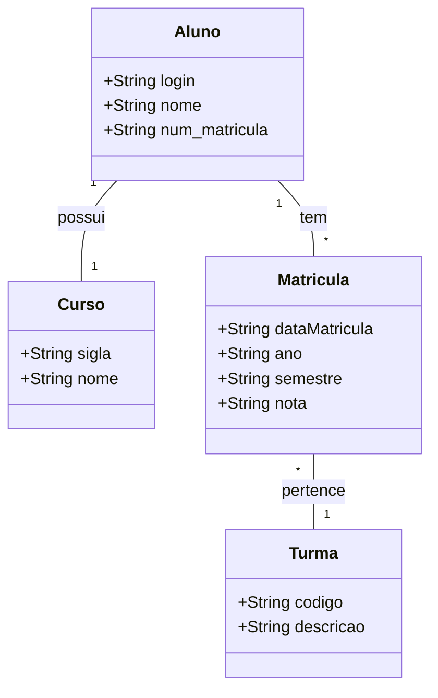

# devweek
API RESTful para controle de matrículas ercolares

## Diagrama de classes

```mermaid
classDiagram
    class Aluno {
        +String login
        +String nome
        +String num_matricula
    }

    class Curso {
        +String sigla
        +String nome
    }

    class Turma {
        +String codigo
        +String descricao
    }

    class Matricula {
        +String dataMatricula
        +String ano
        +String semestre
        +String nota
    }

    Aluno "1" -- "1" Curso : possui
    Aluno "1" -- "*" Matricula : tem
    Matricula "*" -- "1" Turma : pertence
```
